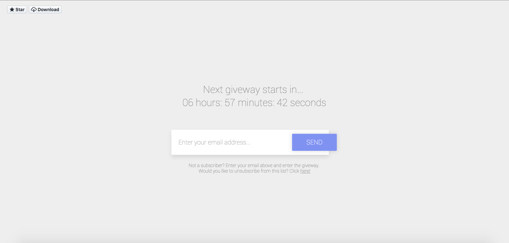

# responsive-countdown-html-css-template

A simple countdown template using HTML, CSS3 and Javascript. This template uses a simple form to subscriber the used to an email listing (not implemented, yet!). You can download this template and use it however you like.

If you'd like to help me, you can always **fork** this repository, make your chances and submit a pull request. I'll then evaluate and commit your changes.

Images
------------

Contributing
-------------

1. Fork the repository on Github;
2. Clone the project into your machine;
3. Commit your changes to your own branch;
4. Push your work to your fork;
5. Submit a pull request for review;

Copyright
-------------

This project is under Apache 2.0 license.